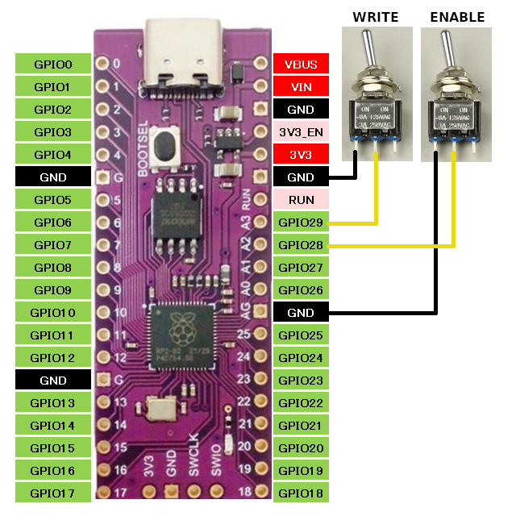

# PicoRAMCart
Emulate Raster/Bob!k/C.P.U. RAM Cartridge with A8PicoCart

## What?

This is an alternative firmware for the [A8PicoCart](https://github.com/robinhedwards/A8PicoCart)
that emulates a RAM cartridge with an XEGS bankswitching scheme.
Original hardware project is [here](http://raster.infos.cz/atari/hw/ramcart/ramcart.htm).

## How?

* You need to connect two switches to the two spare GPIO pins (28 and 29) for a functional cartridge.



* Download the new firmware from the releases page and flash it to your A8PicoCart.
* Insert the cartridge in your Atari with both switches in the OFF position. On the image above that is to the left.
* Switch on your computer and boot one of the two supplied ATR images.
* Run ```RFF21```.
* Press ```RETURN``` for a directory listing.
* Select one of the ROM files with the cursor keys and press ```RETURN``` again.
* Follow on-screen instructions:
  * Turn both switches ON.
  * Press ```RETURN```.
  * Wait for the file to be copied to the cartridge.
  * Turn OFF write enable switch.
  * Press ```RESET```.

The two ROMs on the original software disk ask you to turn OFF the cartridge after it is booted. This is normal behaviour. The program has been copied to normal RAM.
The second disk contains two programs that actually run from ROM and need the cartridge enable switch to stay in the ON position.

## Who?

PicoRAMCart is Copyright © 2025 by Ivo van Poorten and is licensed under the terms of the BSD 2-Clause license.
